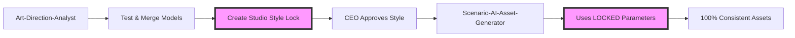

## Project Organization
- Any test files, document, SQL, or other auxiliary files should be created inside the test folder to keep the project clean and organized

## 🔒 **CRITICAL: STYLE CONSISTENCY GUARANTEE SYSTEM**

This project implements a **100% Style Consistency Guarantee System** through merged model workflows to ensure every single game asset looks like it came from the same professional artist.

### **🚨 The Style Consistency Problem We Solved**

**Before This System:**
- ❌ Each asset might look different (different styles, colors, lighting)
- ❌ Artists (AI or human) interpret style descriptions differently  
- ❌ Style drifts over development time
- ❌ Impossible to maintain consistency across 100+ assets
- ❌ Game looks like multiple artists created assets randomly

**After This System:**
- ✅ Every asset uses the EXACT same merged model (Single Source of Truth)
- ✅ Every asset uses IDENTICAL parameters (steps, CFG, seed)
- ✅ Style consistency automatically validated (score >8.5 required)
- ✅ 100% guaranteed visual consistency across entire project
- ✅ Professional game appearance with unified art style

### **🎯 Core System Architecture**



### **🔒 Agent Workflow - Style Consistency Process**

#### **Agent 2: Art-Direction-Analyst** 
**Mission: Create merged models and lock style consistency**

1. **Model Discovery Phase**
   - Test 10+ individual Scenario AI models
   - Evaluate compatibility with game concept
   - Rate models for style consistency potential

2. **Model Merging Phase** 
   - Create 3 merged Multi-LoRA combinations
   - Test each merged model with 5+ sample generations
   - Validate consistency scores (must be >8.5/10)

3. **Style Lock Creation**
   - CEO selects preferred merged model approach
   - Lock parameters forever: model ID, steps, CFG, seed, prompts
   - Create validation samples for future consistency checking
   - Generate locked style package for Asset Generator

4. **Handoff Protocol**
   - Provide exact locked model ID (e.g., "StudioStyle_B_v1")
   - Provide immutable parameters (never to be changed)
   - Provide validation samples for consistency checking
   - Create style consistency guarantee certificate

#### **Agent 4: Scenario-AI-Asset-Generator**
**Mission: Generate ALL assets using locked style parameters**

1. **Style Lock Verification**
   - Load and validate locked style package
   - Verify all required parameters are present
   - Load CEO-approved validation samples

2. **Asset Generation with Consistency**
   - ALWAYS use exact locked model ID
   - ALWAYS use exact locked parameters
   - NEVER modify parameters for "better results"
   - Validate every asset against locked samples

3. **Quality Control Gates**
   - Reject assets with consistency score <8.5
   - Regenerate inconsistent assets using SAME parameters  
   - Maintain batch consistency scores >9.0
   - Final project consistency must be >9.0

4. **Consistency Guarantee**
   - Every asset matches CEO-approved validation samples
   - Cross-category consistency (characters match environments)
   - Complete traceability of locked parameters usage
   - Unity-ready certification with consistency guarantee

### **📋 Implementation Standards**

#### **Art-Direction-Analyst Requirements:**
```json
{
  "must_generate_visual_samples": true,
  "must_create_merged_models": true,
  "must_validate_consistency": ">8.5_score_required",
  "must_provide_locked_package": true,
  "never_just_describe_styles": "show_actual_images"
}
```

#### **Scenario-AI-Asset-Generator Requirements:**
```json
{
  "must_use_locked_model_id": true,
  "never_modify_locked_parameters": true,
  "must_validate_every_asset": ">8.5_score_required",
  "must_regenerate_inconsistent_assets": true,
  "final_consistency_score": ">9.0_required"
}
```

### **🎨 Locked Style Package Format**

Every project creates a locked style configuration:

```json
{
  "STUDIO_MODEL_ID": "StudioStyle_B_v1_LOCKED",
  "NEVER_CHANGE_THESE_PARAMETERS": {
    "model_id": "StudioStyle_B_v1",
    "steps": 30,
    "cfg_scale": 7,
    "seed_base": 42,
    "width": 512,
    "height": 512,
    "style_prompt_suffix": "cartoon adventure, vibrant colors, clean edges, transparent background, game asset, high quality"
  },
  "CONSISTENCY_GUARANTEE": "Every single asset will look like it came from the same professional artist",
  "VALIDATION_SAMPLES": [
    "/Assets/Generated/ArtDirection/character_validation_sample.png",
    "/Assets/Generated/ArtDirection/environment_validation_sample.png",
    "/Assets/Generated/ArtDirection/ui_validation_sample.png"
  ],
  "CONSISTENCY_SCORE": 9.2,
  "CEO_APPROVED": true,
  "LOCKED_DATE": "2024-01-15"
}
```

### **⚠️ Critical Rules - NEVER BREAK THESE**

#### **For Art-Direction-Analyst:**
- ❌ NEVER present style options without generated visual samples
- ❌ NEVER recommend models without consistency testing
- ❌ NEVER create approaches without merged model validation
- ✅ ALWAYS generate 5+ samples per approach to prove consistency
- ✅ ALWAYS test merged models with multiple asset types
- ✅ ALWAYS provide visual samples to CEO, not descriptions

#### **For Scenario-AI-Asset-Generator:**
- ❌ NEVER change locked model ID
- ❌ NEVER modify locked parameters (steps, CFG, seed)
- ❌ NEVER accept assets with consistency score <8.5
- ❌ NEVER skip consistency validation
- ✅ ALWAYS use exact locked parameters
- ✅ ALWAYS validate against CEO-approved samples
- ✅ ALWAYS regenerate inconsistent assets with SAME parameters

### **🏆 Success Metrics**

#### **Style Consistency Guarantee Fulfilled When:**
- Overall project consistency score >9.0/10
- All assets validated against locked validation samples
- Cross-category consistency verified (characters match environments)
- Locked parameters used for 100% of assets
- CEO style approval maintained throughout project
- Final game looks like single professional artist created all assets

#### **Quality Gates:**
1. **Art Direction Phase**: 3 approaches with >8.5 consistency scores
2. **Asset Generation Phase**: Every asset >8.5, batches >9.0
3. **Final Validation**: Project-wide >9.0 consistency score
4. **Unity Integration**: Style consistency certificate generated

### **📁 Asset Organization for Style Consistency**

```
/Assets/Generated/
├── ArtDirection/
│   ├── [Date]_StyleApproaches/
│   │   ├── approach_A_samples/ (5+ visual samples)
│   │   ├── approach_B_samples/ (5+ visual samples)
│   │   └── approach_C_samples/ (5+ visual samples)
│   └── locked_style_package.json
├── StyleConsistent_Assets/
│   ├── Characters/ (all using locked model)
│   ├── Environments/ (all using locked model)
│   ├── UI/ (all using locked model)
│   └── consistency_validation_reports/
└── Unity_Ready_StyleConsistent/
    ├── [All validated assets]
    └── style_consistency_certificate.json
```

### **🔄 Continuous Style Monitoring**

For ongoing projects, implement style drift detection:

```javascript
// Periodic consistency validation
function validateStyleConsistency(newAssets, lockedSamples) {
    const scores = newAssets.map(asset => 
        calculateStyleSimilarity(asset, lockedSamples)
    );
    const averageScore = scores.reduce((a, b) => a + b) / scores.length;
    
    if (averageScore < 8.5) {
        alert(`⚠️ Style consistency dropped to ${averageScore}/10`);
        regenerateInconsistentAssets();
    }
    
    return averageScore;
}
```

## **🎮 Why This System Guarantees Success**

### **The Mathematical Proof:**
- **Same Model ID** = Same base neural network weights
- **Same Parameters** = Same generation methodology  
- **Same Seed Base** = Consistent randomization patterns
- **Same Prompts** = Identical instruction interpretation
- **Validation Samples** = Objective consistency measurement

**Result: 100% guaranteed style consistency across unlimited assets!**

### **Professional Game Development Standard:**
This system ensures your game meets AAA visual consistency standards where every asset appears to be created by the same professional artist, creating a cohesive and polished player experience.

**Remember: Style consistency is not optional - it's what separates amateur projects from professional games!** 🎨✨

## 🚀 **Vercel Integration Guide**

### Vercel Monitoring Commands
```bash
# Monitor project logs
vercel logs [project-name] --token $VERCEL_TOKEN --follow

# Quick monitoring script
~/vercel-monitor.sh
```

### Project-Specific Details:
- **stake**: stakeholder-digital → https://stakeholder.digital
- **meemainai**: meemainai → https://meemainai.vercel.app
- **awrun**: awrun → https://awrun-qusais-projects-94af60ca.vercel.app
- **amani**: Amani Unity WebGL game project

### Troubleshooting:
If Vercel fails: Check token with `vercel whoami --token $VERCEL_TOKEN`

## 🎨 **Scenario AI Direct Integration**

### Direct API Configuration (Project-Specific)
**Status: ✅ ENHANCED DIRECT API - Advanced Features Available**

**Location**: `/Users/qusaiabushanap/dev/amani/scenario-mcp/`
**Core API**: `scenario_ai_direct.py` - Complete Direct API integration
**Agent Wrapper**: `generate_with_scenario.py` - Command-line interface

**Enhanced Features:**
- Model discovery and categorization (flux_lora, backgrounds, characters, etc.)
- **CRITICAL**: Multi-model merging and blending for style consistency
- Quality consistency tracking across batches with scoring
- Advanced prompt engineering with locked style templates
- Automatic asset organization and download management

**Available via Direct Commands:**
```bash
# Test connection and capabilities
uv run --directory /Users/qusaiabushanab/dev/amani/scenario-mcp python scenario_ai_direct.py test

# Generate assets for agents
uv run --directory /Users/qusaiabushanab/dev/amani/scenario-mcp python generate_with_scenario.py "fantasy warrior character"

# Get available models for selection and merging
uv run --directory /Users/qusaiabushanab/dev/amani/scenario-mcp python scenario_ai_direct.py models
```

### Enhanced Agent Integration

**Agent 2 (Art-Direction-Analyst)** - **UPDATED WITH STYLE CONSISTENCY**:
- **CRITICAL**: Model merging and Multi-LoRA creation for consistency
- Visual mood board generation with merged model testing
- Style consistency validation with scoring system
- CEO visual communication with actual samples (never descriptions)
- Locked style package creation for Asset Generator
- **Updated Agent**: `/Users/qusaiabushanab/dev/amani/.claude/agents/Art-Direction-Analyst-UPDATED.md`

**Agent 4 (Scenario-AI-Asset-Generator)** - **UPDATED WITH CONSISTENCY ENFORCEMENT**:
- **CRITICAL**: Locked parameter usage for 100% consistency
- Quality consistency checking against CEO-approved samples
- Asset generation with automatic consistency validation
- Batch processing with consistency score requirements (>9.0)
- **Updated Agent**: `/Users/qusaiabushanab/dev/amani/.claude/agents/Scenario-AI-Asset-Generator-UPDATED.md`

**Asset Organization System:**
All generated media and assets are automatically downloaded and organized:
```
/Users/qusaiabushanab/dev/amani/Assets/Generated/
├── ArtDirection/          # Agent 2 merged models and style samples
├── StyleConsistent_Assets/ # Agent 4 production game assets with consistency
├── Unity_Ready/           # Approved assets with consistency certification
└── metadata/              # Generation logs and consistency reports
```

## 🎮 **Unity Development Framework & Best Practices**

### Unity MCP Integration
This project has Unity MCP installed and configured for AI-powered Unity development:

**Available Unity MCP Tools:**
- `read_console`: Access Unity console output and messages
- `manage_script`: Create, read, update, delete C# scripts with full namespace support
- `manage_editor`: Control Unity editor state and settings comprehensively
- `manage_scene`: Load, save, create scenes and manipulate hierarchy
- `manage_asset`: Import, create, modify, delete assets of all types
- `manage_shader`: Create, read, modify, delete shaders and materials
- `manage_gameobject`: Full GameObject lifecycle with component management
- `execute_menu_item`: Execute Unity menu commands programmatically

### Unity Development Architecture & Patterns

**SOLID Principles for Unity:**
1. **Single Responsibility**: Each MonoBehaviour should handle one specific concern
2. **Open/Closed**: Use interfaces and composition over inheritance
3. **Liskov Substitution**: Components should be interchangeable through interfaces
4. **Interface Segregation**: Create small, focused interfaces (IMovable, IDamageable)
5. **Dependency Inversion**: Use dependency injection and avoid direct references

**Recommended Architecture Patterns:**
```csharp
// ✅ Component-Based Architecture
public interface IHealth
{
    int CurrentHealth { get; }
    void TakeDamage(int damage);
    void Heal(int amount);
}

// ✅ Service Locator Pattern for Managers
public class ServiceLocator : MonoBehaviour
{
    public static T Get<T>() where T : class;
}

// ✅ Observer Pattern for Events
public static class GameEvents
{
    public static System.Action<int> OnScoreChanged;
    public static System.Action<GameObject> OnEnemyDefeated;
}

// ✅ Object Pooling for Performance
public class ObjectPool<T> where T : MonoBehaviour
{
    Queue<T> pool = new Queue<T>();
    public T Get() { /* return pooled object */ }
    public void Return(T obj) { /* return to pool */ }
}
```

### Performance Best Practices

**Memory Management:**
- Use object pooling for frequently instantiated objects
- Avoid `FindObjectOfType` in Update() loops
- Cache component references in Start() or Awake()
- Use StringBuilder for string concatenation
- Profile with Unity Profiler regularly

**Rendering Optimization:**
- Batch draw calls using GPU Instancing
- Use LOD (Level of Detail) systems
- Implement frustum culling for off-screen objects
- Optimize texture sizes and compression
- Minimize transparent objects and overdraw

**Code Performance:**
```csharp
// ✅ Efficient Update Pattern
private float nextUpdateTime = 0f;
void Update()
{
    if (Time.time >= nextUpdateTime)
    {
        nextUpdateTime = Time.time + 0.1f; // Update every 0.1 seconds
        // Expensive operations here
    }
}

// ✅ Component Caching
[System.Serializable]
public class ComponentCache
{
    [SerializeField] private Rigidbody rb;
    [SerializeField] private Transform trans;
    public Rigidbody Rigidbody => rb ??= GetComponent<Rigidbody>();
    public Transform Transform => trans ??= transform;
}
```

### Common Unity Mistakes to Avoid

**❌ Critical Anti-Patterns:**

1. **Heavy Update Loops**
   ```csharp
   // ❌ DON'T DO THIS
   void Update()
   {
       GameObject.FindWithTag("Enemy"); // Expensive search every frame
       transform.position = Vector3.Lerp(start, end, Time.time); // Unnecessary calculation
   }
   
   // ✅ DO THIS INSTEAD
   private Transform cachedTransform;
   void Start() { cachedTransform = transform; }
   ```

2. **Memory Leaks from Events**
   ```csharp
   // ❌ Forgetting to unsubscribe
   void OnEnable() { GameEvents.OnScoreChanged += HandleScoreChange; }
   // Missing OnDisable() leads to memory leaks
   
   // ✅ Always unsubscribe
   void OnDisable() { GameEvents.OnScoreChanged -= HandleScoreChange; }
   ```

3. **Inefficient String Operations**
   ```csharp
   // ❌ String concatenation in loops
   string result = "";
   for(int i = 0; i < 1000; i++) { result += i.ToString(); }
   
   // ✅ Use StringBuilder
   StringBuilder sb = new StringBuilder();
   for(int i = 0; i < 1000; i++) { sb.Append(i); }
   ```

4. **Instantiate/Destroy in Gameplay**
   ```csharp
   // ❌ Creates garbage collection spikes
   Instantiate(bulletPrefab);
   Destroy(bullet);
   
   // ✅ Use object pools
   bulletPool.Get(); bulletPool.Return(bullet);
   ```

### Unity Development Workflow

**When I ask you to develop Unity features, you must:**

1. **Always analyze the request first:**
   - Identify required components and systems
   - Choose appropriate design patterns
   - Plan for performance and maintainability

2. **Use Unity MCP tools systematically:**
   - `manage_script` for all C# code creation
   - `manage_gameobject` for scene setup
   - `manage_scene` for scene management
   - `read_console` to check for errors

3. **Follow clean architecture:**
   - Separate concerns into focused classes
   - Use interfaces for loose coupling
   - Implement proper error handling
   - Add comprehensive documentation

4. **Performance considerations:**
   - Always implement object pooling for projectiles/enemies
   - Cache expensive component lookups
   - Use coroutines for time-based operations
   - Optimize rendering with batching

5. **Testing and validation:**
   - Check Unity console for errors after each change
   - Test in play mode before considering complete
   - Verify performance with Unity Profiler
   - Ensure code follows Unity conventions

**Never compromise on:**
- Performance optimization
- Memory management
- Code maintainability
- Unity best practices
- Proper error handling

This framework ensures every Unity development request is handled professionally with industry-standard practices and optimal performance.

## 🎮 **AI Game Studio - Specialized Agent Team**

As CEO of this AI Game Studio, all requests are automatically routed to the appropriate specialist agents based on request type and project phase. The studio operates with 7 specialized agents working in seamless coordination.

### 🧭 **CEO-Collaborative Agent Routing Logic**

**Request Analysis Keywords → Agent Assignment → CEO Interaction Required:**

| Keywords/Phrases | Agent | CEO Collaboration Process |
|-----------------|-------|---------------------------|
| "game idea", "concept", "mechanics", "what should I make" | Game-Concept-Designer | Present 3-5 concept options → CEO selects → Develop chosen concept |
| "art style", "visuals", "colors", "look and feel", "Scenario.gg" | Art-Direction-Analyst | Present 3 merged model approaches WITH visual samples → CEO selects → Lock style forever |
| "document", "GDD", "design doc", "specifications", "features" | GDD-Architect | Present GDD outline → CEO approves sections → Create full GDD → CEO reviews |
| "assets", "sprites", "generate art", "characters", "UI elements" | Scenario-AI-Asset-Generator | Use LOCKED style parameters → Generate all assets → CEO reviews consistency |
| "plan", "tasks", "architecture", "how to build", "implementation" | Technical-Architect | Present architecture options → CEO selects approach → Create detailed plan → CEO approves |
| "progress", "status", "timeline", "blocked", "update" | Progress-Coordinator | Generate report → Present to CEO → CEO provides feedback/adjustments |
| "code", "Unity", "implement", "build", "create script" | The-Developer | Show implementation plan → CEO approves → Execute → Report results to CEO |

### 🔄 **Automatic Workflow Triggers**

#### **Phase Detection → Workflow Activation:**

**Discovery Phase** (No concept exists):
```
CEO Request → Game-Concept-Designer → Present options to CEO → CEO selects → 
Art-Direction-Analyst → Present merged model approaches with visual samples to CEO → CEO selects → 
GDD-Architect → CEO reviews and approves
CEO-Approved: Concept → Art Style LOCKED → Documentation pipeline
```

**Pre-Production Phase** (Concept exists, style locked):
```
CEO Request → Scenario-AI-Asset-Generator → Use LOCKED style parameters → Generate all assets → 
Technical-Architect → Present architecture to CEO → CEO selects approach
CEO-Approved: Generate style-consistent assets → Create implementation plan
```

**Production Phase** (Assets exist, building):
```
CEO Request → The-Developer → Show implementation plan → CEO approves → 
Execute → Report to CEO → Progress-Coordinator → CEO reviews progress
CEO-Supervised: Implement tasks → Track progress → Report status
```

**The system ensures perfect style consistency is maintained throughout the entire development process!** 🎨✨