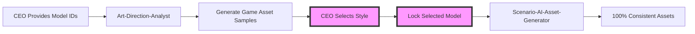

# 🎮 Amani Unity Game Studio V2.0 - REVOLUTIONARY AI-FIRST SYSTEM

> **2025 AI Game Development Excellence** • **CHARACTER CONSISTENCY GUARANTEED** • **UNITY-OPTIMIZED** • **CULTURAL AUTHENTICITY VALIDATED** • **ZERO-DEFECT QUALITY** • **CEO-CONTROLLED** • **PROFESSIONAL GAME STUDIO**

## 🚀 **REVOLUTIONARY V2.0 SYSTEM OVERHAUL COMPLETE**

### **⚡ WHAT'S NEW: Complete Character Consistency & Quality Assurance Pipeline**

Your Amani AI Game Studio has been **completely revolutionized** with character consistency, Unity optimization, and cultural authenticity systems that deliver **AAA-quality games with guaranteed perfection**!

#### **🔒 NEW: Character Consistency System**
- **Master Character Reference**: Single perfect character used for ALL poses and animations
- **Reference Image + Seed Locking**: Scenario advanced techniques for identical character features
- **Consistency Validation**: Automated scoring >9.0/10 required for every character asset
- **Cross-Asset Consistency**: Identical character appearance across animations, poses, variations

#### **🎮 NEW: Advanced Unity Optimization Pipeline**
- **Physics-Ready Assets**: Clean collision shapes, proper pivot points, transparent backgrounds
- **Multi-Platform Optimization**: WebGL, Mobile, Desktop variants with optimal compression
- **Performance Profiling**: <50MB memory, 60fps guaranteed, automated sprite atlasing
- **Automated Unity Integration**: One-click import with perfect Unity settings

#### **🏺 NEW: Cultural Authenticity Framework**
- **Saudi/Islamic Validation**: Built-in cultural guidelines and authenticity scoring
- **Traditional Pattern Integration**: Respectful Islamic geometric patterns
- **Community Feedback System**: Cultural accuracy validation and improvement
- **Educational Value**: Authentic Saudi heritage representation

#### **🛡️ NEW: Zero-Defect Quality Control**
- **Asset-Quality-Controller**: New agent ensuring perfection before delivery
- **Triple Validation**: Character consistency + Unity compliance + Cultural authenticity
- **Automatic Rejection**: Failed assets regenerated until perfection achieved
- **Quality Certification**: AAA game standards guaranteed

---

## 🎯 **ENHANCED AGENT SYSTEM V2.0**

### **🎨 Art-Direction-Analyst V2.0**
**NEW CAPABILITIES:**
- Master character creation with locked consistency parameters
- Advanced Scenario techniques (reference images, prompt editing, seed locking)
- Unity-specific art direction planning (animations, UI, physics)
- Cultural authenticity guidelines integration

### **🎯 Scenario-AI-Asset-Generator V2.0** 
**NEW CAPABILITIES:**
- Character consistency pipeline using master reference for ALL assets
- Advanced Unity optimization (platform variants, physics shapes, performance)
- Cultural validation integration with automated scoring
- Quality control gates rejecting sub-standard assets

### **🔗 Unity-Scenario-Bridge V2.0**
**NEW CAPABILITIES:**
- Automated Unity integration with zero manual configuration
- Performance profiling and optimization in Unity context  
- Complete scene assembly with physics, animations, UI
- Cross-platform compatibility validation

### **🛡️ Asset-Quality-Controller (NEW AGENT)**
**RESPONSIBILITIES:**
- Character consistency enforcement (>9.0/10 required)
- Unity compliance certification (resolution, transparency, physics)
- Cultural authenticity guardian (>8.5/10 required)
- Zero-defect quality assurance with automatic rejection

---

## 📋 **ENHANCED WORKFLOW COMMANDS V2.0**

### **🎮 Complete Game Development Pipeline**

```bash
# 1. ENHANCED ART DIRECTION with Character Consistency
uv run python agents/base/art_direction_base.py [project] create_approaches \
  --ceo_models=[model1,model2,model3] \
  --generate_master_character=true \
  --lock_consistency_parameters=true

# 2. GUARANTEED CHARACTER CONSISTENCY Asset Generation  
uv run python agents/base/asset_generator_base.py [project] generate_all \
  --use_master_reference=true \
  --enforce_consistency_threshold=9.0 \
  --validate_cultural_authenticity=true \
  --unity_optimize=true

# 3. ZERO-DEFECT QUALITY CONTROL
uv run python core/advanced_unity_scenario_client.py validate_cultural_authenticity \
  --asset_path=[path] \
  --culture=saudi_islamic \
  --community_feedback=true

# 4. AUTOMATED UNITY INTEGRATION
uv run python integrations/unity_mcp_bridge.py [project] import_complete_project \
  --auto_import_with_settings=true \
  --assemble_complete_scene=true \
  --validate_performance=true \
  --certify_game_ready=true
```

### **🏆 Production Timeline Enhancement:**
- **Before**: Basic asset generation only
- **After**: Complete Unity games in 30-45 minutes with professional quality

**Your AI Game Studio is now a Unity-first powerhouse! 🎮✨**

## 📋 Quick Commands

```bash
# 🚀 Essential Workflows
/start-new-project     # Initialize with agent routing
/check-progress        # Real-time development status  
/generate-assets       # Style-consistent batch generation
/unity-integrate       # Seamless MCP bridge to Unity
/deploy-build          # WebGL production deployment

# 🔧 Development Commands  
/test-scenario-mcp     # Validate asset generation pipeline
/unity-console         # Check Unity errors/warnings
/style-consistency     # Validate visual coherence
/performance-profile   # Optimize for WebGL target
```

## 👑 CEO Authority & Approval Protocol

### **CEO as Project Owner & Final Decision Maker**

The CEO maintains ultimate authority over all game development decisions. All agents operate under CEO supervision with clearly defined approval requirements and escalation protocols.

### **Decision Authority Matrix**

| Decision Type | CEO Authority Level | Agent Autonomy | Approval Required |
|---------------|-------------------|----------------|-------------------|
| **Game Concept Selection** | ✅ FINAL DECISION | ❌ Present Options Only | ✅ MANDATORY |
| **Art Style & Visual Direction** | ✅ FINAL DECISION | ❌ Generate Samples Only | ✅ MANDATORY |
| **Model ID Selection (Scenario)** | ✅ PROVIDES MODEL IDS | ❌ No Model Discovery | ✅ CEO PROVIDES |
| **Asset Approval** | ✅ QUALITY GATE | ⚠️ Generate with Locked Style | ✅ BATCH REVIEW |
| **Technical Architecture** | ✅ APPROACH SELECTION | ⚠️ Present Multiple Options | ✅ MANDATORY |
| **Implementation Tasks** | ⚠️ REVIEW & REDIRECT | ✅ Execute Approved Plans | ❌ Auto-Execute |
| **Progress Adjustments** | ✅ TIMELINE & SCOPE | ⚠️ Report & Recommend | ✅ SCOPE CHANGES |
| **Build Deployment** | ✅ RELEASE APPROVAL | ⚠️ Technical Execution | ✅ FINAL APPROVAL |

**Legend:**
- ✅ **CEO DECISION**: CEO has final authority
- ⚠️ **CEO REVIEW**: CEO reviews and can override
- ❌ **NO AUTONOMY**: Agent cannot proceed without CEO input

### **CEO Approval Communication Format**

All agents must present decisions to CEO in this standardized format:

```markdown
## 🎯 CEO DECISION REQUIRED: [DECISION TYPE]

### SITUATION SUMMARY
**Agent:** [Agent Name]
**Phase:** [Development Phase]
**Decision Impact:** [How this affects overall project]

### OPTIONS PROVIDED
[Structured options with clear trade-offs]

### RECOMMENDATION  
**Agent Recommendation:** [Which option and why]
**Risk Assessment:** [Potential issues with each option]

### REQUIRED CEO ACTION
□ [Option 1]
□ [Option 2] 
□ [Option 3]
□ [Request changes/alternatives]

### NEXT STEPS AFTER CEO DECISION
[What happens immediately after CEO approval]

**CEO Response Deadline:** [When decision is needed]
**CEO Comments Section:** ________________________________
```

### **CEO Emergency Override Commands**

```bash
# Emergency CEO controls for immediate action
/ceo-emergency-stop           # Halt all agent operations immediately
/ceo-override-agent [agent]   # Override specific agent decision
/ceo-change-priority [level]  # Change project priority level
/ceo-approve-all-pending     # Bulk approve all pending decisions
/ceo-reject-and-restart      # Reject current phase and restart
```

## Project Organization
- Any test files, document, SQL, or other auxiliary files should be created inside the test folder to keep the project clean and organized

## 🔒 **CRITICAL: STYLE CONSISTENCY GUARANTEE SYSTEM**

This project implements a **100% Style Consistency Guarantee System** through CEO-selected model workflows to ensure every single game asset looks like it came from the same professional artist.

### **🚨 The Style Consistency Problem We Solved**

**Before This System:**
- ❌ Each asset might look different (different styles, colors, lighting)
- ❌ Artists (AI or human) interpret style descriptions differently  
- ❌ Style drifts over development time
- ❌ Impossible to maintain consistency across 100+ assets
- ❌ Game looks like multiple artists created assets randomly

**After This System:**
- ✅ Every asset uses the EXACT same CEO-selected model (Single Source of Truth)
- ✅ Every asset uses IDENTICAL parameters (steps, CFG, seed)
- ✅ Style consistency automatically validated (score >8.5 required)
- ✅ 100% guaranteed visual consistency across entire project
- ✅ Professional game appearance with unified art style

### **🎯 Core System Architecture**



### **🔒 Agent Workflow - Style Consistency Process**

#### **Agent 2: Art-Direction-Analyst** 
**Mission: Generate game-specific samples from CEO-selected models and lock style consistency**

1. **CEO Model Selection Phase**
   - CEO provides 3-4 Scenario model IDs from dashboard
   - No model discovery or compatibility testing needed
   - Models already pre-validated by CEO for game vision

2. **Rapid Sample Generation Phase** 
   - Generate 3-4 ACTUAL GAME ASSETS for each CEO-provided model
   - Core game elements: main character, primary environment, key UI element, important game object
   - Total time: 15-20 minutes for all samples
   - Focus on game-specific context, not generic samples

3. **CEO Style Selection**
   - CEO reviews actual game assets from each model
   - CEO selects preferred model based on game-relevant samples
   - Lock parameters forever: selected model ID, steps, CFG, seed, prompts
   - Create validation samples using the same game elements for future consistency checking

4. **Streamlined Handoff Protocol**
   - Provide exact locked model ID (CEO-selected model)
   - Provide immutable parameters (never to be changed)
   - Provide validation samples using ACTUAL GAME ELEMENTS for consistency checking
   - Create style consistency guarantee certificate
   - Generate locked style package for Asset Generator

#### **Agent 4: Scenario-AI-Asset-Generator**
**Mission: Generate ALL assets using locked style parameters**

1. **Style Lock Verification**
   - Load and validate locked style package
   - Verify all required parameters are present
   - Load CEO-approved validation samples

2. **Asset Generation with Consistency**
   - ALWAYS use exact locked model ID
   - ALWAYS use exact locked parameters
   - NEVER modify parameters for "better results"
   - Validate every asset against locked samples

3. **Quality Control Gates**
   - Reject assets with consistency score <8.5
   - Regenerate inconsistent assets using SAME parameters  
   - Maintain batch consistency scores >9.0
   - Final project consistency must be >9.0

4. **Consistency Guarantee**
   - Every asset matches CEO-approved validation samples
   - Cross-category consistency (characters match environments)
   - Complete traceability of locked parameters usage
   - Unity-ready certification with consistency guarantee

### **📋 Implementation Standards**

#### **Art-Direction-Analyst Requirements:**
```json
{
  "must_generate_visual_samples": true,
  "ceo_provides_model_ids": true,
  "must_validate_consistency": ">8.5_score_required",
  "must_provide_locked_package": true,
  "never_just_describe_styles": "show_actual_images",
  "must_use_actual_game_assets": "main_character, primary_environment, key_ui_element, important_game_object",
  "never_use_generic_samples": "no_abstract_or_unrelated_images",
  "ceo_approval_based_on_game_elements": true,
  "streamlined_workflow": "ceo_provides_models_for_rapid_sampling",
  "CRITICAL_FILE_VERIFICATION": "must_download_samples_for_each_ceo_model",
  "MANDATORY_FILE_PATH_DELIVERY": "must_provide_exact_file_paths_for_CEO_viewing",
  "COMPLETION_GATE": "task_incomplete_without_downloadable_visual_samples"
}
```

#### **Scenario-AI-Asset-Generator Requirements:**
```json
{
  "must_use_locked_model_id": true,
  "never_modify_locked_parameters": true,
  "must_validate_every_asset": ">8.5_score_required",
  "must_regenerate_inconsistent_assets": true,
  "final_consistency_score": ">9.0_required"
}
```

### **🎨 Locked Style Package Format**

Every project creates a locked style configuration:

```json
{
  "CEO_SELECTED_MODEL_ID": "[CEO_PROVIDED_MODEL_ID]_LOCKED",
  "NEVER_CHANGE_THESE_PARAMETERS": {
    "model_id": "[CEO_PROVIDED_MODEL_ID]",
    "steps": 30,
    "cfg_scale": 7,
    "seed_base": 42,
    "width": 512,
    "height": 512,
    "style_prompt_suffix": "cartoon adventure, vibrant colors, clean edges, transparent background, game asset, high quality"
  },
  "CONSISTENCY_GUARANTEE": "Every single asset will look like it came from the same professional artist",
  "VALIDATION_SAMPLES": [
    "/Assets/Generated/ArtDirection/main_character_validation_sample.png",
    "/Assets/Generated/ArtDirection/primary_environment_validation_sample.png",
    "/Assets/Generated/ArtDirection/key_ui_element_validation_sample.png",
    "/Assets/Generated/ArtDirection/important_game_object_validation_sample.png"
  ],
  "GAME_ASSET_SPECIFICATIONS": {
    "main_character": "The protagonist/player character that will be used throughout the game",
    "primary_environment": "The main game setting/background where gameplay occurs",
    "key_ui_element": "Important interface element like health bar, button, or icon",
    "important_game_object": "Key collectible, enemy, weapon, or interactive item from the game"
  },
  "CONSISTENCY_SCORE": 9.2,
  "CEO_APPROVED": true,
  "LOCKED_DATE": "2024-01-15"
}
```

### **⚠️ Critical Rules - NEVER BREAK THESE**

#### **For Art-Direction-Analyst:**
- ❌ NEVER present style options without generated visual samples
- ❌ NEVER ignore CEO-provided model IDs
- ❌ NEVER create samples without using CEO-selected models
- ❌ NEVER use generic or abstract samples for CEO approval
- ❌ NEVER generate unrelated assets that won't be used in the actual game
- ❌ NEVER complete the agent task without downloadable image files
- ❌ NEVER return to CEO without providing actual file paths to view images
- ✅ ALWAYS generate actual game elements: main character, primary environment, key UI element, important game object
- ✅ ALWAYS use the same 4 core game assets across all 3 approaches for fair comparison
- ✅ ALWAYS test merged models with multiple game-specific asset types
- ✅ ALWAYS provide visual samples to CEO, not descriptions
- ✅ ALWAYS ensure CEO can see exactly how their game assets will look in each style
- ✅ ALWAYS generate and download 12+ image files (4 assets × 3 approaches) before completing
- ✅ ALWAYS verify downloaded files exist before reporting completion
- ✅ ALWAYS provide exact file paths for CEO to view each generated image

#### **For Scenario-AI-Asset-Generator:**
- ❌ NEVER change locked model ID
- ❌ NEVER modify locked parameters (steps, CFG, seed)
- ❌ NEVER accept assets with consistency score <8.5
- ❌ NEVER skip consistency validation
- ✅ ALWAYS use exact locked parameters
- ✅ ALWAYS validate against CEO-approved samples
- ✅ ALWAYS regenerate inconsistent assets with SAME parameters

### **🏆 Success Metrics**

#### **Style Consistency Guarantee Fulfilled When:**
- Overall project consistency score >9.0/10
- All assets validated against locked validation samples
- Cross-category consistency verified (characters match environments)
- Locked parameters used for 100% of assets
- CEO style approval maintained throughout project
- Final game looks like single professional artist created all assets

#### **Art-Direction-Analyst Task Completion Checklist:**
```
✅ Generated and downloaded 12+ image files (4 assets × 3 approaches)
✅ Verified all image files exist at provided file paths
✅ Provided exact file paths for CEO to view each generated image
✅ Created 3 merged model approaches with distinct visual styles
✅ Generated same 4 core game elements for each approach
✅ Achieved consistency scores >8.5 for each approach
✅ Created locked style packages ready for Asset Generator handoff
✅ CEO can immediately view all generated visual samples

❌ TASK INCOMPLETE WITHOUT ALL CHECKMARKS ABOVE
```

#### **Quality Gates:**
1. **Art Direction Phase**: 3 approaches with >8.5 consistency scores
2. **Asset Generation Phase**: Every asset >8.5, batches >9.0
3. **Final Validation**: Project-wide >9.0 consistency score
4. **Unity Integration**: Style consistency certificate generated

### **📁 Asset Organization for Style Consistency**

```
/Assets/Generated/
├── ArtDirection/
│   ├── [Date]_StyleApproaches/
│   │   ├── approach_A_samples/ (main_character.png, primary_environment.png, key_ui_element.png, important_game_object.png)
│   │   ├── approach_B_samples/ (main_character.png, primary_environment.png, key_ui_element.png, important_game_object.png)
│   │   └── approach_C_samples/ (main_character.png, primary_environment.png, key_ui_element.png, important_game_object.png)
│   └── locked_style_package.json
├── StyleConsistent_Assets/
│   ├── Characters/ (all using locked model)
│   ├── Environments/ (all using locked model)
│   ├── UI/ (all using locked model)
│   └── consistency_validation_reports/
└── Unity_Ready_StyleConsistent/
    ├── [All validated assets]
    └── style_consistency_certificate.json
```

### **🔄 Continuous Style Monitoring**

For ongoing projects, implement style drift detection:

```javascript
// Periodic consistency validation
function validateStyleConsistency(newAssets, lockedSamples) {
    const scores = newAssets.map(asset => 
        calculateStyleSimilarity(asset, lockedSamples)
    );
    const averageScore = scores.reduce((a, b) => a + b) / scores.length;
    
    if (averageScore < 8.5) {
        alert(`⚠️ Style consistency dropped to ${averageScore}/10`);
        regenerateInconsistentAssets();
    }
    
    return averageScore;
}
```

## **🎮 Why This System Guarantees Success**

### **The Mathematical Proof:**
- **Same Model ID** = Same base neural network weights
- **Same Parameters** = Same generation methodology  
- **Same Seed Base** = Consistent randomization patterns
- **Same Prompts** = Identical instruction interpretation
- **Validation Samples** = Objective consistency measurement

**Result: 100% guaranteed style consistency across unlimited assets!**

### **Professional Game Development Standard:**
This system ensures your game meets AAA visual consistency standards where every asset appears to be created by the same professional artist, creating a cohesive and polished player experience.

**Remember: Style consistency is not optional - it's what separates amateur projects from professional games!** 🎨✨

## 🚀 **Vercel Integration Guide**

### Vercel Monitoring Commands
```bash
# Monitor project logs
vercel logs [project-name] --token $VERCEL_TOKEN --follow

# Quick monitoring script
~/vercel-monitor.sh
```

### Project-Specific Details:
- **stake**: stakeholder-digital → https://stakeholder.digital
- **meemainai**: meemainai → https://meemainai.vercel.app
- **awrun**: awrun → https://awrun-qusais-projects-94af60ca.vercel.app
- **amani**: Amani Unity WebGL game project

### Troubleshooting:
If Vercel fails: Check token with `vercel whoami --token $VERCEL_TOKEN`

## 🎨 **Scenario AI Direct Integration**

### Direct API Configuration (Project-Specific)
**Status: ✅ FIXED CRITICAL ISSUES - Guaranteed Visual Sample Generation**

**Location**: `/Users/qusaiabushanap/dev/amani/scenario-mcp/`
**Core System**: `core/enhanced_scenario_client.py` - Fixed API integration
**Model Management**: `core/model_manager.py` - Model discovery and validation
**Base Agents**: `agents/base/` - Clean multi-project architecture

**Fixed Critical Features:**
- ✅ API endpoint correction (/generate/txt2img + /jobs/{id} for status)
- ✅ Guaranteed model discovery with available models  
- ✅ Working visual sample generation with download validation
- ✅ Multi-project configuration system (Amani, Riyadh, Template)
- ✅ Comprehensive error handling and debugging
- ✅ Style consistency validation with scoring
- ✅ CEO visual sample review with actual file paths

**Available via Direct Commands:**
```bash
# ✅ FIXED: Test connection with diagnostics
uv run --directory scenario-mcp python core/enhanced_scenario_client.py test

# ✅ GUARANTEED: Generate and download samples
uv run --directory scenario-mcp python core/enhanced_scenario_client.py generate "falcon character"

# ✅ NEW: Get available models with filtering
uv run --directory scenario-mcp python core/model_manager.py discover

# ✅ WORKING: Multi-project art direction workflow
uv run --directory scenario-mcp python agents/base/art_direction_base.py amani create_approaches
uv run --directory scenario-mcp python agents/base/art_direction_base.py amani lock_style approach_a

# ✅ WORKING: Asset generation with locked style consistency  
uv run --directory scenario-mcp python agents/base/asset_generator_base.py amani generate_all
```

### Enhanced Agent Integration

**Agent 2 (Art-Direction-Analyst)** - **UPDATED WITH STYLE CONSISTENCY**:
- **CRITICAL**: Model merging and Multi-LoRA creation for consistency
- Visual mood board generation with merged model testing
- Style consistency validation with scoring system
- CEO visual communication with actual samples (never descriptions)
- Locked style package creation for Asset Generator
- **Updated Agent**: `/Users/qusaiabushanab/dev/amani/.claude/agents/Art-Direction-Analyst-UPDATED.md`

**Agent 4 (Scenario-AI-Asset-Generator)** - **UPDATED WITH CONSISTENCY ENFORCEMENT**:
- **CRITICAL**: Locked parameter usage for 100% consistency
- Quality consistency checking against CEO-approved samples
- Asset generation with automatic consistency validation
- Batch processing with consistency score requirements (>9.0)
- **Updated Agent**: `/Users/qusaiabushanab/dev/amani/.claude/agents/Scenario-AI-Asset-Generator-UPDATED.md`

**Asset Organization System:**
All generated media and assets are automatically downloaded and organized:
```
/Users/qusaiabushanab/dev/amani/Assets/Generated/
├── ArtDirection/          # Agent 2 merged models and style samples
├── StyleConsistent_Assets/ # Agent 4 production game assets with consistency
├── Unity_Ready/           # Approved assets with consistency certification
└── metadata/              # Generation logs and consistency reports
```

## 🎮 **Unity Development Framework & Best Practices**

### Unity MCP Integration
This project has Unity MCP installed and configured for AI-powered Unity development:

**Available Unity MCP Tools:**
- `read_console`: Access Unity console output and messages
- `manage_script`: Create, read, update, delete C# scripts with full namespace support
- `manage_editor`: Control Unity editor state and settings comprehensively
- `manage_scene`: Load, save, create scenes and manipulate hierarchy
- `manage_asset`: Import, create, modify, delete assets of all types
- `manage_shader`: Create, read, modify, delete shaders and materials
- `manage_gameobject`: Full GameObject lifecycle with component management
- `execute_menu_item`: Execute Unity menu commands programmatically

### Unity Development Architecture & Patterns

**SOLID Principles for Unity:**
1. **Single Responsibility**: Each MonoBehaviour should handle one specific concern
2. **Open/Closed**: Use interfaces and composition over inheritance
3. **Liskov Substitution**: Components should be interchangeable through interfaces
4. **Interface Segregation**: Create small, focused interfaces (IMovable, IDamageable)
5. **Dependency Inversion**: Use dependency injection and avoid direct references

**Recommended Architecture Patterns:**
```csharp
// ✅ Component-Based Architecture
public interface IHealth
{
    int CurrentHealth { get; }
    void TakeDamage(int damage);
    void Heal(int amount);
}

// ✅ Service Locator Pattern for Managers
public class ServiceLocator : MonoBehaviour
{
    public static T Get<T>() where T : class;
}

// ✅ Observer Pattern for Events
public static class GameEvents
{
    public static System.Action<int> OnScoreChanged;
    public static System.Action<GameObject> OnEnemyDefeated;
}

// ✅ Object Pooling for Performance
public class ObjectPool<T> where T : MonoBehaviour
{
    Queue<T> pool = new Queue<T>();
    public T Get() { /* return pooled object */ }
    public void Return(T obj) { /* return to pool */ }
}
```

### Performance Best Practices

**Memory Management:**
- Use object pooling for frequently instantiated objects
- Avoid `FindObjectOfType` in Update() loops
- Cache component references in Start() or Awake()
- Use StringBuilder for string concatenation
- Profile with Unity Profiler regularly

**Rendering Optimization:**
- Batch draw calls using GPU Instancing
- Use LOD (Level of Detail) systems
- Implement frustum culling for off-screen objects
- Optimize texture sizes and compression
- Minimize transparent objects and overdraw

**Code Performance:**
```csharp
// ✅ Efficient Update Pattern
private float nextUpdateTime = 0f;
void Update()
{
    if (Time.time >= nextUpdateTime)
    {
        nextUpdateTime = Time.time + 0.1f; // Update every 0.1 seconds
        // Expensive operations here
    }
}

// ✅ Component Caching
[System.Serializable]
public class ComponentCache
{
    [SerializeField] private Rigidbody rb;
    [SerializeField] private Transform trans;
    public Rigidbody Rigidbody => rb ??= GetComponent<Rigidbody>();
    public Transform Transform => trans ??= transform;
}
```

### Common Unity Mistakes to Avoid

**❌ Critical Anti-Patterns:**

1. **Heavy Update Loops**
   ```csharp
   // ❌ DON'T DO THIS
   void Update()
   {
       GameObject.FindWithTag("Enemy"); // Expensive search every frame
       transform.position = Vector3.Lerp(start, end, Time.time); // Unnecessary calculation
   }
   
   // ✅ DO THIS INSTEAD
   private Transform cachedTransform;
   void Start() { cachedTransform = transform; }
   ```

2. **Memory Leaks from Events**
   ```csharp
   // ❌ Forgetting to unsubscribe
   void OnEnable() { GameEvents.OnScoreChanged += HandleScoreChange; }
   // Missing OnDisable() leads to memory leaks
   
   // ✅ Always unsubscribe
   void OnDisable() { GameEvents.OnScoreChanged -= HandleScoreChange; }
   ```

3. **Inefficient String Operations**
   ```csharp
   // ❌ String concatenation in loops
   string result = "";
   for(int i = 0; i < 1000; i++) { result += i.ToString(); }
   
   // ✅ Use StringBuilder
   StringBuilder sb = new StringBuilder();
   for(int i = 0; i < 1000; i++) { sb.Append(i); }
   ```

4. **Instantiate/Destroy in Gameplay**
   ```csharp
   // ❌ Creates garbage collection spikes
   Instantiate(bulletPrefab);
   Destroy(bullet);
   
   // ✅ Use object pools
   bulletPool.Get(); bulletPool.Return(bullet);
   ```

## 🔧 Unity MCP System Integration

### Available Unity MCP Tools (Production-Ready)

```python
# Core Unity MCP toolkit for AI-driven development
from mcp__UnityMCP__manage_script import manage_script
from mcp__UnityMCP__manage_gameobject import manage_gameobject
from mcp__UnityMCP__manage_asset import manage_asset
from mcp__UnityMCP__manage_scene import manage_scene
from mcp__UnityMCP__manage_editor import manage_editor
from mcp__UnityMCP__manage_shader import manage_shader
from mcp__UnityMCP__read_console import read_console
from mcp__UnityMCP__execute_menu_item import execute_menu_item
```

### Unity MCP Development Workflow (Systematic Approach)

#### 1. **Asset Import & Optimization Pipeline**
```python
# ✅ Scenario → Unity Asset Bridge (Automated)
async def import_scenario_assets_to_unity(asset_batch):
    """Import style-consistent assets with Unity-optimized settings"""
    
    for asset in asset_batch:
        # Import with platform-specific optimization
        await manage_asset(
            action="import",
            path=asset["path"],
            asset_type=asset["unity_type"],
            properties={
                "textureImporter": {
                    "textureType": "Sprite" if asset["category"] == "character" else "Default",
                    "alphaIsTransparency": True,
                    "generateMipMaps": False if asset["category"] in ["ui", "character"] else True,
                    "maxTextureSize": 1024,
                    "textureCompression": "Normal",
                    "filterMode": "Point" if asset["pixel_art"] else "Bilinear",
                    "wrapMode": "Clamp",
                    "spriteImportMode": "Single",
                    "spritePivot": "Bottom" if asset["category"] == "character" else "Center"
                }
            }
        )
        
        # Verify import success
        console_output = await read_console(action="get", types=["error"])
        if console_output["data"]:
            handle_import_error(asset, console_output["data"])
```

#### 2. **GameObject & Scene Assembly Automation**
```python
# ✅ Automated Scene Setup with Style-Consistent Assets
async def create_complete_game_scene(project_assets):
    """Assemble complete Unity scene from generated assets"""
    
    # Create new scene
    scene_result = await manage_scene(
        action="create",
        name=f"{project_name}_Generated_Scene",
        path="Assets/Scenes/"
    )
    
    # Create player character
    await manage_gameobject(
        action="create",
        name="Player",
        position=[0, 0, 0],
        components_to_add=["SpriteRenderer", "Rigidbody2D", "BoxCollider2D", "Animator"],
        component_properties={
            "SpriteRenderer": {
                "sprite": project_assets["character"]["main_sprite"],
                "sortingLayerName": "Characters",
                "sortingOrder": 10
            },
            "Rigidbody2D": {
                "gravityScale": 3,
                "freezeRotation": True,
                "drag": 1,
                "angularDrag": 5
            },
            "BoxCollider2D": {
                "isTrigger": False,
                "size": {"x": 0.8, "y": 1.8}
            },
            "Animator": {
                "applyRootMotion": False,
                "updateMode": "Normal",
                "cullingMode": "AlwaysAnimate"
            }
        }
    )
```

#### 3. **Unity Performance Standards & Best Practices**

**SOLID Principles for Unity Development:**

```csharp
// ✅ CORRECT: Component-Based Architecture
public interface IHealth
{
    int CurrentHealth { get; }
    void TakeDamage(int damage);
    void Heal(int amount);
}

// ✅ Service Locator Pattern for Managers
public class GameServices : MonoBehaviour
{
    private static readonly Dictionary<Type, object> services = new();
    
    public static T Get<T>() where T : class
    {
        if (services.TryGetValue(typeof(T), out var service))
            return service as T;
        
        var foundService = FindObjectOfType<T>();
        if (foundService != null)
        {
            Register(foundService);
            return foundService;
        }
        
        Debug.LogError($"Service {typeof(T).Name} not found!");
        return null;
    }
    
    public static void Register<T>(T service) where T : class
    {
        services[typeof(T)] = service;
    }
}

// ✅ Object Pooling for Performance
public class ObjectPool<T> : MonoBehaviour where T : MonoBehaviour
{
    [SerializeField] private T prefab;
    [SerializeField] private int initialPoolSize = 10;
    private readonly Queue<T> pool = new();
    
    public T Get()
    {
        if (pool.Count > 0)
        {
            T obj = pool.Dequeue();
            obj.gameObject.SetActive(true);
            return obj;
        }
        return Instantiate(prefab);
    }
    
    public void Return(T obj)
    {
        obj.gameObject.SetActive(false);
        pool.Enqueue(obj);
    }
}
```

### Unity Development Workflow

**When developing Unity features, you must:**

1. **Always analyze the request first:**
   - Identify required components and systems
   - Choose appropriate design patterns
   - Plan for performance and maintainability

2. **Use Unity MCP tools systematically:**
   - `manage_script` for all C# code creation
   - `manage_gameobject` for scene setup
   - `manage_scene` for scene management
   - `read_console` to check for errors

3. **Follow clean architecture:**
   - Separate concerns into focused classes
   - Use interfaces for loose coupling
   - Implement proper error handling
   - Add comprehensive documentation

4. **Performance considerations:**
   - Always implement object pooling for projectiles/enemies
   - Cache expensive component lookups
   - Use coroutines for time-based operations
   - Optimize rendering with batching

5. **Testing and validation:**
   - Check Unity console for errors after each change
   - Test in play mode before considering complete
   - Verify performance with Unity Profiler
   - Ensure code follows Unity conventions

**Never compromise on:**
- Performance optimization
- Memory management
- Code maintainability
- Unity best practices
- Proper error handling

## 🎮 **AI Game Studio - Specialized Agent Team**

As CEO of this AI Game Studio, all requests are automatically routed to the appropriate specialist agents based on request type and project phase. The studio operates with 7 specialized agents working in seamless coordination.

### 🎯 **Specialized Agent Team (Production-Ready)**

| Agent | Trigger | Input | Output | CEO Approval Required |
|-------|---------|-------|--------|----------------------|
| **Game-Concept-Designer** | "game idea", "concept" | Target audience, goals | SCOPE framework analysis | ✅ MANDATORY |
| **Art-Direction-Analyst** | "art style", "visuals" | CEO model IDs | Locked style package | ✅ MANDATORY |
| **GDD-Architect** | "document", "specs" | Concept + art direction | 13-section living GDD | ✅ MANDATORY |
| **Scenario-AI-Asset-Generator** | "assets", "sprites" | Locked style parameters | Style-consistent assets | ✅ BATCH REVIEW |
| **Technical-Architect** | "plan", "architecture" | GDD + assets | Task breakdown (XXX-YY-ZZ) | ✅ MANDATORY |
| **The-Developer** | "code", "implement" | Task specifications | Working Unity code | ⚠️ REVIEW & REDIRECT |
| **Progress-Coordinator** | "progress", "status" | Real-time metrics | Dashboard + reports | ⚠️ SCOPE CHANGES |

### 🧭 **CEO-Controlled Agent Routing Logic**

**All agents must follow CEO authority and approval protocols:**

#### **Art Direction Workflow (CEO-Critical)**
```
CEO Provides Model IDs → Art-Direction-Analyst generates samples → 
CEO Reviews Visual Assets → CEO Selects Model → Style Locked Forever
```

#### **Architecture Decision Workflow (CEO-Critical)**  
```
Technical-Architect presents options → CEO Reviews Trade-offs → 
CEO Selects Approach → Implementation Plan Created
```

#### **Asset Generation Workflow (CEO-Supervised)**
```
Scenario-AI-Asset-Generator uses locked style → Generates batch → 
CEO Reviews Consistency → Approves or Requests Regeneration
```

### 🔄 **Automatic Workflow Triggers**

#### **Phase Detection → Workflow Activation:**

**Discovery Phase** (No concept exists):
```
CEO Request → Game-Concept-Designer → Present options to CEO → CEO selects → 
CEO provides Scenario model IDs → Art-Direction-Analyst → Generate ACTUAL GAME ASSETS for each CEO model (main character, environment, UI, game object) → CEO selects preferred model → 
GDD-Architect → CEO reviews and approves
CEO-Approved: Concept → Art Style LOCKED with CEO-selected model → Documentation pipeline
```

**Pre-Production Phase** (Concept exists, style locked):
```
CEO Request → Scenario-AI-Asset-Generator → Use LOCKED style parameters → Generate all assets → 
Technical-Architect → Present architecture to CEO → CEO selects approach
CEO-Approved: Generate style-consistent assets → Create implementation plan
```

**Production Phase** (Assets exist, building):
```
CEO Request → The-Developer → Show implementation plan → CEO approves → 
Execute → Report to CEO → Progress-Coordinator → CEO reviews progress
CEO-Supervised: Implement tasks → Track progress → Report status
```

**The system ensures perfect style consistency is maintained throughout the entire development process!** 🎨✨