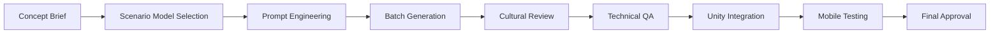

# 🎨 Amani - Traditional Saudi Heritage Art Direction Specifications

## Executive Summary

**Selected Approach:** Traditional Saudi Heritage Style  
**Target Audience:** Children (educational game for MeemAI)  
**Platform:** Unity WebGL (Mobile-optimized)  
**Cultural Focus:** Authentic Saudi Arabian heritage with Islamic geometric patterns  

---

## 🏛️ Visual Style Guide - Traditional Saudi Heritage

### Visual Philosophy
Amani embraces the rich cultural heritage of Saudi Arabia through authentic traditional design elements that educate and inspire children. The visual approach combines respectful representation of Islamic geometric patterns, warm desert aesthetics, and child-friendly accessibility while maintaining premium educational quality.

### Color Palette
**Primary Desert Warm Palette:**
- **#D4A574** - Warm Sand (primary backgrounds)
- **#8B4513** - Rich Terracotta (UI accents, borders)
- **#CD853F** - Desert Gold (highlights, collectibles)
- **#2E8B57** - Oasis Green (nature elements, success states)
- **#B8860B** - Deep Gold (premium elements, achievements)

**Supporting Cultural Colors:**
- **#FFFFFF** - Pure White (text, important UI)
- **#2F4F4F** - Dark Slate (secondary text, shadows)
- **#F5DEB3** - Wheat (soft backgrounds, panels)

### Typography & Text Requirements
**Arabic Text Optimization:**
- Font Family: "Cairo" or "Noto Sans Arabic" (Google Fonts)
- Minimum Size: 18px for mobile readability
- Line Height: 1.6x for Arabic text clarity
- Right-to-left text flow support
- High contrast ratios (minimum 4.5:1 against backgrounds)

### Mood & Emotional Response
**Target Emotions:** Wonder, Cultural Pride, Learning Joy  
**Visual Descriptors:** Warm, Welcoming, Authentic, Educational, Respectful

### Reference Games Inspiration
- Monument Valley (geometric patterns, spatial design)
- Alto's Odyssey (desert aesthetics, warm colors)
- Gris (artistic expression, cultural sensitivity)

---

## 🔧 Scenario.gg Implementation Strategy

### Primary Model Recommendation
**Model Selection:** "Islamic Geometric Patterns" + "Children's Book Illustration"
- Search at scenario.gg/community for: "Islamic geometric", "children illustration", "cultural heritage"
- Primary Model: Look for models trained on Islamic art and educational content
- Fallback Models: "Flat Design Illustration", "Educational Game Assets"

### Model Selection Process

1. **Go to scenario.gg/community**
2. **Search Keywords:** 
   - "Islamic geometric patterns"
   - "Arabian architecture"  
   - "Desert landscape illustration"
   - "Educational game assets"
   - "Cultural heritage art"

3. **Test Prompts:**
   ```
   Test 1: "traditional Islamic geometric pattern, warm desert colors, transparent background"
   Test 2: "Saudi Arabian architecture element, child-friendly, educational game asset"
   Test 3: "desert oasis scene, traditional Middle Eastern style, mobile game"
   ```

4. **Evaluation Criteria:**
   - ✅ Cultural authenticity without stereotypes
   - ✅ Child-appropriate content
   - ✅ Clean, geometric line work
   - ✅ Warm color palette compatibility
   - ✅ Transparent background capability

### Master Prompt Template Structure
```
"[OBJECT], traditional Saudi Arabian style, Islamic geometric patterns, warm desert palette, child-friendly, educational game asset, transparent background, high quality, mobile optimized, culturally respectful"
```

### Specific Asset Prompt Templates

**Characters:**
```
"[character description], traditional Saudi dress, child-friendly cartoon style, Islamic geometric pattern details, warm desert colors (#D4A574, #8B4513), transparent background, game asset, culturally respectful"
```

**Environment Elements:**
```
"[environment object], traditional Arabian architecture style, geometric Islamic patterns, desert landscape, warm sand tones, mobile game asset, transparent background, educational friendly"
```

**UI Elements:**
```
"[UI element], traditional Islamic geometric border, warm desert gold (#CD853F), minimalist design, child-friendly interface, transparent background, mobile optimized"
```

**Cultural Objects:**
```
"traditional Saudi [object], authentic cultural representation, Islamic geometric details, educational game asset, warm color palette, transparent background, respectful portrayal"
```

---

## 📁 Asset Categories & Generation Priorities

### Priority 1 - Core Game Assets (Day 1)
**Essential for MVP functionality**

**Main Character (5 variations):**
- Character idle state - traditional Saudi clothing
- Character walking animation frames (3-4 frames)
- Character interaction pose
- Character celebration pose
- Character learning/thinking pose

**Core UI Elements (8 pieces):**
- Main menu background with geometric patterns
- Button designs (primary/secondary) with Islamic borders
- Progress bar with traditional motifs
- Score display panel with Arabic numerals
- Settings panel with geometric frame
- Pause menu overlay
- Achievement notification banner
- Level completion celebration screen

**Essential Environment (6 types):**
- Desert sand ground tiles (seamless)
- Traditional building background elements
- Basic geometric platform tiles
- Simple palm tree/oasis elements
- Sky gradient background layers
- Sand dune background elements

### Priority 2 - Gameplay Assets (Day 2)
**Enhances interaction and engagement**

**Interactive Objects (10 variations):**
- Collectible items (traditional artifacts, geometric gems)
- Educational tools (scrolls, books with Arabic text)
- Cultural objects (traditional pottery, textiles)
- Puzzle pieces with geometric patterns
- Power-up items with cultural significance
- Traditional architectural elements (pillars, arches)
- Desert flora (cacti, palm fronds)
- Learning stations (traditional tents, courtyards)
- Movement platforms (flying carpets, traditional boats)
- Challenge obstacles (culturally appropriate)

**Gameplay Feedback (6 types):**
- Success particle effects (golden stars, geometric sparkles)
- Error indication (gentle sand swirl)
- Collection effects (shimmering gold dust)
- Level progression indicators
- Hint system visuals
- Audio-visual sync indicators

### Priority 3 - Polish & Atmosphere (Day 3)
**Creates immersive cultural experience**

**Environmental Atmosphere (8 layers):**
- Parallax background layers (distant mountains, desert horizon)
- Animated environmental elements (blowing sand, cloth movement)
- Time of day variations (dawn, midday, sunset)
- Weather effects (gentle sandstorms, clear skies)
- Cultural architecture backdrops (traditional buildings)
- Oasis scenes with water reflections
- Traditional marketplace backgrounds
- Educational institution settings

**Cultural Enhancement (7 elements):**
- Traditional pattern borders and frames
- Authentic Arabic calligraphy elements (decorative only)
- Islamic geometric transition animations
- Cultural celebration particle effects
- Traditional textile pattern overlays
- Architectural detail embellishments
- Heritage symbol integration

---

## 🛡️ Cultural Authenticity Guidelines

### Cultural Sensitivity Requirements
**Mandatory Considerations:**

1. **Religious Respect:**
   - No representation of religious figures
   - Islamic geometric patterns used decoratively only
   - Arabic text used for educational purposes only
   - No religious symbols used inappropriately

2. **Cultural Accuracy:**
   - Traditional clothing represented respectfully
   - Architecture based on authentic Saudi heritage
   - Colors reflect genuine desert and cultural palette
   - Avoid orientalist stereotypes or exaggerations

3. **Educational Value:**
   - Each cultural element should educate about Saudi heritage
   - Accurate historical context when applicable
   - Promote cultural understanding and appreciation
   - Age-appropriate cultural information

4. **Community Guidelines:**
   - Content reviewed for cultural appropriateness
   - Avoid any potentially offensive imagery
   - Emphasize positive cultural values
   - Respectful representation of all characters

### Quality Checklist for Cultural Content
**Before Asset Approval:**
- ✅ Does this represent Saudi culture respectfully?
- ✅ Would this educate children positively about heritage?
- ✅ Are Islamic patterns used appropriately?
- ✅ Does this avoid cultural stereotypes?
- ✅ Is the content age-appropriate for children?
- ✅ Does this enhance cultural understanding?

---

## 📱 Mobile Optimization Specifications

### Technical Requirements for Unity WebGL

**Asset Specifications:**
- **Resolution:** 1024x1024 maximum for main assets
- **Format:** PNG with transparency support
- **Compression:** Unity's default compression settings
- **Texture Size:** Power of 2 dimensions preferred
- **Color Depth:** 32-bit RGBA for transparency, 24-bit RGB for backgrounds

**Performance Optimization:**
- **Sprite Atlas Usage:** Group related assets for batch rendering
- **LOD Strategy:** Create simplified versions for distant objects
- **Animation Frames:** Maximum 8 frames per animation sequence
- **Particle Systems:** Limit to 50 particles maximum simultaneously
- **Draw Calls:** Target maximum 20 draw calls per frame

**Mobile-Specific Design:**
- **Touch Targets:** Minimum 44px touch areas
- **UI Scaling:** Vector-based UI elements where possible
- **Text Legibility:** High contrast, large enough for small screens
- **Performance Budget:** 30 FPS minimum on mobile devices
- **Loading Strategy:** Progressive asset loading to reduce initial load time

### Asset Organization Structure
```
Assets/
├── Art/
│   ├── Characters/
│   │   ├── MainCharacter/
│   │   └── NPCs/
│   ├── Environment/
│   │   ├── Backgrounds/
│   │   ├── Platforms/
│   │   └── Props/
│   ├── UI/
│   │   ├── Buttons/
│   │   ├── Panels/
│   │   └── Icons/
│   └── Effects/
│       ├── Particles/
│       └── Transitions/
```

---

## 🔄 Art Production Pipeline



### Production Workflow Steps

**Phase 1: Preparation (30 minutes)**
1. Review asset requirements from priority list
2. Prepare Scenario.gg workspace
3. Load selected model and test prompts
4. Set up batch generation parameters

**Phase 2: Generation (2 hours)**
1. Generate Priority 1 assets using refined prompts
2. Cultural authenticity review for each asset
3. Technical quality check (resolution, transparency)
4. Create variations where needed

**Phase 3: Refinement (1 hour)**
1. Post-processing for Unity compatibility
2. Organize assets according to folder structure
3. Create sprite atlases for performance
4. Prepare documentation for handoff

**Phase 4: Integration (30 minutes)**
1. Import assets into Unity project
2. Configure sprite settings and compression
3. Test on mobile preview
4. Validate performance metrics

### Quality Assurance Checklist

**Visual Quality:**
- ✅ Consistent style across all assets
- ✅ Appropriate resolution for intended use
- ✅ Clean edges and proper transparency
- ✅ Color palette consistency maintained

**Cultural Authenticity:**
- ✅ Culturally appropriate representation
- ✅ Educational value maintained
- ✅ Respectful portrayal of heritage
- ✅ Age-appropriate content for children

**Technical Standards:**
- ✅ Optimal file sizes for web delivery
- ✅ Unity-compatible formats and settings
- ✅ Performance budget compliance
- ✅ Mobile device compatibility

---

## 📋 Detailed Handoff Package for Scenario AI Asset Generator

### Immediate Action Items

**Step 1: Environment Setup (15 minutes)**
- Create Scenario.gg account and workspace
- Search and bookmark recommended models
- Prepare batch generation folders
- Download and install Unity project structure

**Step 2: Model Selection & Testing (30 minutes)**
- Test primary model: "Islamic Geometric Patterns + Educational"
- Validate fallback models: "Flat Design Illustration"
- Run test prompts with provided templates
- Evaluate results against cultural guidelines

**Step 3: Priority 1 Asset Generation (2 hours)**
Execute this exact sequence:

1. **Main Character Creation:**
   ```
   Prompt: "friendly Saudi child character, traditional white thobe, cartoon style, Islamic geometric pattern details, warm desert colors #D4A574 #8B4513, transparent background, educational game asset, culturally respectful"
   
   Variations needed: idle, walking, celebration, interaction, thinking
   ```

2. **Core UI Elements:**
   ```
   Prompt: "game UI button, traditional Islamic geometric border, warm desert gold #CD853F, minimalist design, child-friendly interface, transparent background, mobile optimized"
   
   Generate: 3 button sizes, progress bar, score panel
   ```

3. **Environment Basics:**
   ```
   Prompt: "desert sand ground tile, traditional Arabian style, seamless texture, warm sand tone #D4A574, game asset, mobile optimized"
   
   Generate: ground tiles, background elements, simple platforms
   ```

### Asset Naming Convention
**Format:** `AmaniGame_[Category]_[AssetName]_[Variation]_[Size].png`

**Examples:**
- `AmaniGame_Character_MainHero_Idle_512.png`
- `AmaniGame_UI_Button_Primary_128.png`
- `AmaniGame_Environment_DesertGround_Tile_256.png`
- `AmaniGame_Effect_Success_Sparkle_64.png`

### Final Deliverable Checklist

**Asset Package Must Include:**
- ✅ All Priority 1 assets (character, UI, environment basics)
- ✅ Organized folder structure as specified
- ✅ Consistent naming convention applied
- ✅ Cultural authenticity verification completed
- ✅ Technical specifications met (resolution, format, optimization)
- ✅ Unity-ready sprite configurations documented
- ✅ Mobile performance validation completed
- ✅ Backup variations for critical assets

**Documentation Package:**
- ✅ Asset usage guidelines
- ✅ Cultural context explanations
- ✅ Technical integration notes
- ✅ Performance optimization recommendations
- ✅ Future expansion roadmap

### Success Metrics
**Quality Standards:**
- Cultural authenticity: 100% compliant
- Technical requirements: All specifications met
- Performance targets: 30 FPS minimum maintained
- Educational value: Clear heritage representation
- Child-appropriate: All content suitable for target age

**Timeline Expectations:**
- Priority 1 completion: 4 hours maximum
- Quality review: 1 hour
- Unity integration: 30 minutes
- Total delivery: Same day completion

---

## 🎯 Project Context Integration

### MeemAI Educational Objectives
**Learning Goals Supported:**
- Cultural heritage appreciation
- Visual pattern recognition
- Traditional art understanding
- Arabic language exposure (appropriate level)
- Saudi cultural values introduction

### Unity WebGL Optimization for Educational Setting
**Classroom Deployment Considerations:**
- Low bandwidth compatibility
- Quick loading times essential
- Stable performance on older devices
- Minimal system requirements
- Easy teacher/parent navigation

### Future Expansion Framework
**Scalable Art System Design:**
- Modular asset architecture
- Consistent style guide application
- Cultural authenticity maintained at scale
- Performance optimization preserved
- Educational content expansion ready

---

**🚀 READY FOR IMMEDIATE HANDOFF**

This comprehensive art direction specification provides everything needed for the Scenario AI Asset Generator to begin immediate asset production for the Amani educational game, ensuring cultural authenticity, mobile optimization, and educational value while maintaining the highest quality standards for traditional Saudi heritage representation.

---

**🎨 Art Direction by Claude Code**  
**Co-Authored-By: Claude <noreply@anthropic.com>**