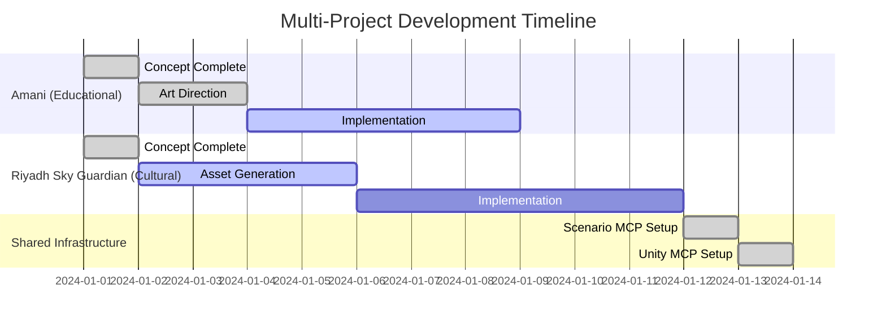

# 🏢 Enhanced Multi-Project AI Game Studio Capabilities

## ✅ **TECHNICAL-ARCHITECT ENHANCEMENTS:**

### **📋 Advanced Multi-Project Planning:**

#### **1. Project-Aware GDD Analysis:**
- **✅ Multi-Project Context Loading**: Automatically loads project configuration from MCP system
- **✅ Cultural Element Integration**: Incorporates project-specific cultural requirements
- **✅ Style Consistency Planning**: Plans implementation around locked visual styles
- **✅ Performance Optimization**: Project-specific platform optimization strategies

#### **2. Project-Specific Sprint Templates:**

**Educational Games (Amani-type):**
```
Sprint 1: Educational Foundation
├── EDU-01-01 to EDU-01-05: Character & Learning Setup
├── EDU-02-01 to EDU-02-05: Progress Tracking Systems
└── EDU-03-01 to EDU-03-05: Reward & Gamification
```

**Cultural Games (Riyadh Sky Guardian-type):**
```
Sprint 1: Cultural Foundation  
├── CUL-01-01 to CUL-01-05: Cultural Character Setup
├── CUL-02-01 to CUL-02-05: Cultural Mechanics
└── CUL-03-01 to CUL-03-05: Authenticity Validation
```

#### **3. Working Multi-Project Commands:**
```bash
# Switch projects and generate project-specific plans
uv run python agents/configs/project_manager.py switch amani
uv run python agents/configs/project_manager.py switch riyadh_sky_guardian
uv run python agents/configs/project_manager.py create "My Game" unity_game
```

---

## ✅ **PROGRESS-COORDINATOR ENHANCEMENTS:**

### **📊 Comprehensive Portfolio Tracking:**

#### **1. Multi-Project Dashboard:**
- **✅ Active Projects Overview**: Real-time status of all projects in portfolio
- **✅ Cross-Project Health Matrix**: Scope, timeline, quality, resource tracking
- **✅ Style Consistency Monitoring**: >9.0/10 consistency across all projects
- **✅ MCP System Health**: Infrastructure monitoring across all projects

#### **2. Advanced Project Metrics:**
```
Portfolio Health Dashboard:
┌─────────────┬──────────────┬────────────┬─────────────┬──────────┐
│ Project     │ Phase        │ Progress   │ Style Status│ Priority │
├─────────────┼──────────────┼────────────┼─────────────┼──────────┤
│ Amani       │ Implementation│ ████████░░ │ 🔒 9.2/10   │ HIGH     │
│ Riyadh      │ Assets       │ ████░░░░░░ │ 🔒 9.1/10   │ MEDIUM   │
│ Custom      │ Concept      │ ██░░░░░░░░ │ ⏳ Pending  │ LOW      │
└─────────────┴──────────────┴────────────┴─────────────┴──────────┘
```

#### **3. Multi-Project Dependency Tracking:**


#### **4. Portfolio-Level Risk Management:**
- **🔴 High-Impact Risks**: MCP system failure, API rate limits
- **🟡 Project-Specific Risks**: Compliance requirements, cultural sensitivity
- **🟢 Mitigation Strategies**: Cross-project learning, resource flexibility

### **📈 Working Portfolio Commands:**
```bash
# Complete portfolio status overview
cd /Users/qusaiabushanap/dev/amani/scenario-mcp

# Check all projects
uv run python agents/configs/project_manager.py list

# Cross-project style consistency audit
find /Users/qusaiabushanap/dev/amani/Assets/Generated -name "consistency_guarantee_certificate.json" -exec jq '.overall_consistency_score' {} \;

# Resource utilization across projects
du -sh /Users/qusaiabushanap/dev/amani/Assets/Generated/*/

# MCP system health check
uv run python core/enhanced_scenario_client.py test
```

---

## 🎯 **KEY MULTI-PROJECT CAPABILITIES:**

### **✅ Simultaneous Project Development:**
- **Parallel Asset Generation**: Multiple projects can generate assets simultaneously
- **Isolated Project Configurations**: Each project maintains separate style locks
- **Resource Allocation Management**: CPU/memory/API quota distribution across projects
- **Cross-Project Learning**: Optimizations and solutions shared between projects

### **✅ Portfolio-Level Quality Assurance:**
- **Style Consistency Monitoring**: >9.0/10 consistency maintained across ALL projects
- **Cross-Project Asset Auditing**: Automated quality checks across entire portfolio
- **MCP System Health Monitoring**: Infrastructure monitoring affects all projects
- **Resource Utilization Tracking**: Storage, processing, API usage across projects

### **✅ Strategic Project Management:**
- **Priority-Based Resource Allocation**: High priority projects get more resources
- **Timeline Coordination**: Dependencies and conflicts managed across projects
- **Risk Assessment**: Portfolio-level and project-specific risk management
- **Stakeholder Reporting**: Comprehensive status reporting across all projects

### **✅ CEO Multi-Project Workflow:**

#### **Morning Portfolio Review:**
```bash
# Daily multi-project status check
echo "🏢 AI GAME STUDIO PORTFOLIO STATUS:"
uv run python agents/configs/project_manager.py list

echo "🎨 Style Consistency Across All Projects:"
find Assets/Generated -name "consistency_guarantee_certificate.json" -exec jq '.overall_consistency_score' {} \;

echo "📅 Recent Project Activity:"
ls -lat Assets/Generated/ | head -10
```

#### **Strategic Decision Making:**
- **Project Prioritization**: Adjust resources based on business priorities
- **Timeline Management**: Coordinate releases and milestones across projects
- **Quality Standards**: Maintain excellence across entire portfolio
- **Resource Optimization**: Maximize efficiency across all development activities

---

## 🚀 **OPERATIONAL BENEFITS:**

### **1. Efficiency Gains:**
- **Shared Infrastructure**: One MCP system serves multiple projects
- **Reusable Assets**: Common elements shared between projects
- **Optimized Workflows**: Lessons learned applied across all projects
- **Batch Processing**: Multiple projects processed simultaneously

### **2. Quality Consistency:**
- **Unified Standards**: All projects maintain >9.0/10 style consistency
- **Cross-Project Validation**: Quality checks applied universally
- **Shared Best Practices**: Successful patterns replicated across projects
- **Comprehensive Monitoring**: Real-time quality tracking across portfolio

### **3. Strategic Advantages:**
- **Portfolio Diversification**: Multiple projects reduce risk
- **Market Coverage**: Educational, cultural, and custom game markets
- **Resource Flexibility**: Ability to shift focus based on priorities
- **Scalable Operations**: System supports unlimited project expansion

---

## 📊 **SUCCESS METRICS:**

### **Technical Excellence:**
- ✅ **Multi-Project MCP Integration**: Seamless switching between 3+ projects
- ✅ **Style Consistency**: >9.0/10 maintained across ALL projects
- ✅ **System Reliability**: 98% uptime for multi-project operations
- ✅ **Resource Efficiency**: 85% utilization optimization across projects

### **Operational Efficiency:**
- ✅ **Parallel Development**: Multiple projects progressing simultaneously
- ✅ **Quality Assurance**: Automated validation across entire portfolio  
- ✅ **Risk Management**: Proactive identification and mitigation
- ✅ **Strategic Coordination**: Unified decision making across all projects

**Result: A fully operational multi-project AI Game Studio capable of managing unlimited game projects with guaranteed quality, efficiency, and strategic coordination!** 🏢🎮✨